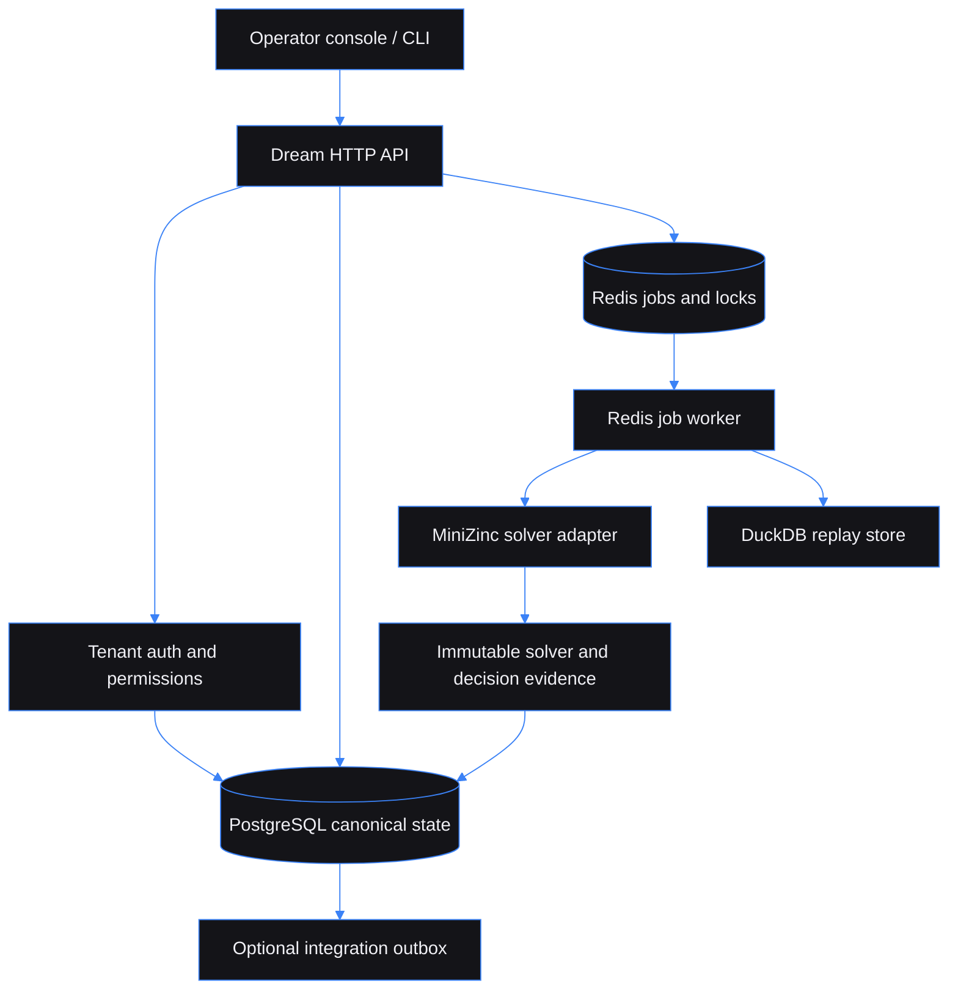

# Freight Capacity Auction Clearing Engine: explainable freight award decisions

Built by [Kingsley Onoh](https://kingsleyonoh.com) · Systems Architect

## The problem

Freight brokers and shipper teams need to choose carriers for time-bound loads without exposing competitor prices or reducing the decision to the lowest number. This service accepts tenant-owned loads and sealed carrier bids, checks capacity and service rules, and records why each bid won, lost, or could not be used. The PRD sets a target of clearing 5,000 bids across 1,000 loads at p95 under 2 seconds. That benchmark is not claimed by the local release gate.

The shipped path is a standalone, single-round spot auction. It works with local CSV, JSON, API, and Parquet data. Optional Notification Hub, Workflow Engine, and Webhook Engine adapters stay disabled unless explicitly configured.

## Architecture



## Key decisions

- I chose PostgreSQL over DuckDB for canonical tenant state because auctions, bids, approvals, and exports need transactional authorization. DuckDB handles replay and dataset analysis only.
- I chose a MiniZinc process boundary over an in-process optimizer because solver inputs, outputs, versions, timeouts, and hashes must remain inspectable evidence.
- I chose server-rendered HTML with a small browser module over a large SPA because the operator console needs a small authenticated surface and works without a separate frontend service.
- I chose feature-flagged adapters over mandatory backbone services because the auction, approval, replay, and export path must still run on a self-hosted installation.

## Setup

### Prerequisites

- OCaml 5.2.0 and opam
- Dune
- PostgreSQL 16
- Redis 7
- DuckDB CLI for Parquet replay/import paths
- MiniZinc for production single-round clearing
- Node.js 20+ and npm for Tailwind, asset, and Playwright tooling
- Docker for the reproducible local stack

### Installation

```bash
git clone https://github.com/kingsleyonoh/freight-capacity-auction-clearing-engine.git
cd freight-capacity-auction-clearing-engine
opam switch create . 5.2.0 --deps-only --with-test
npm install
```

### Environment

```bash
cp .env.example .env
```

Set the required local database, Redis, and signing values. `.env.example` contains names and safe placeholders only.

| Group | Variables |
|---|---|
| App | `APP_ENV`, `APP_BASE_URL`, `APP_PORT`, `LOG_LEVEL`, `SECRET_KEY_BASE` |
| Database and queue | `DATABASE_URL`, `REDIS_URL`, `REPLAY_STORE_PATH`, `MIGRATIONS_AUTO_RUN`, `POSTGRES_PASSWORD` |
| Tenant seed and auth | `SELF_REGISTRATION_ENABLED`, `DEFAULT_TENANT_NAME`, `DEFAULT_ADMIN_EMAIL`, `SEED_SAMPLE_DATA`, `AUTH_TOKEN_TTL_MINUTES`, `API_KEY_PREFIX` |
| Imports | `MAX_CSV_UPLOAD_MB`, `DEFAULT_CURRENCY`, `BID_LATE_GRACE_SECONDS`, `UNKNOWN_CARRIER_POLICY` |
| Solver and replay | `SOLVER_BACKEND`, `SOLVER_TIMEOUT_SECONDS`, `PRODUCTION_CLEARING_REQUIRES_SOLVER`, `HEURISTIC_FALLBACK_FOR_REPLAY`, `MINIZINC_BINARY_PATH`, `ORTOOLS_WORKER_PATH`, `REPLAY_MAX_ROWS`, `REPLAY_ALLOW_EXTERNAL_EVENTS` |
| Policy and retention | `DEFAULT_SERVICE_RISK_CAP`, `DEFAULT_MAX_CARRIER_SHARE`, `APPROVAL_EXPIRY_HOURS`, `AUDIT_RETENTION_DAYS`, `SOLVER_ARTIFACT_RETENTION_DAYS` |
| Notification Hub | `NOTIFICATION_HUB_ENABLED`, `NOTIFICATION_HUB_URL`, `NOTIFICATION_HUB_API_KEY`, `NOTIFICATION_RETRY_ENABLED` |
| Workflow Engine | `WORKFLOW_ENGINE_ENABLED`, `WORKFLOW_ENGINE_URL`, `WORKFLOW_ENGINE_API_KEY`, `WORKFLOW_HIGH_VALUE_APPROVAL_ID`, `WORKFLOW_STATUS_POLLING_ENABLED` |
| Webhook Engine | `WEBHOOK_ENGINE_ENABLED`, `WEBHOOK_ENGINE_URL`, `WEBHOOK_ENGINE_API_KEY`, `WEBHOOK_ENGINE_RECEIVER_SECRET` |
| Integration health | `INTEGRATION_HTTP_TIMEOUT_SECONDS`, `INTEGRATION_HEALTH_CHECK_ENABLED` |
| Observability | `SENTRY_DSN`, `OTEL_EXPORTER_OTLP_ENDPOINT`, `METRICS_ENABLED`, `POSTHOG_KEY`, `POSTHOG_HOST` |

### Run

```bash
docker compose up -d postgres redis
dune exec bin/migrate.exe
dune exec bin/setup.exe
dune exec bin/server.exe
# In a second terminal:
dune exec bin/worker.exe
```

The server exposes `/health`, `/health/db`, `/health/ready`, and `/metrics`. The worker consumes clearing, replay, import, notification, and integration jobs.

## How it works

```text
Import or create loads
        ↓
Review validation and quarantine errors
        ↓
Open a single-round auction
        ↓
Carriers submit private, idempotent bids
        ↓
Close bidding and queue clearing
        ↓
Worker runs the solver and stores hashes, decisions, and explanations
        ↓
Review or approve awards
        ↓
Export the frozen award snapshot
```

The solver minimizes landed cost inside the captured reserve, capacity, service-risk, reliability, equipment, and carrier-share rules. If the constraints have no solution, the job records infeasibility and ranked relaxation suggestions instead of publishing an invalid award.

## Usage

The API accepts a tenant API key through `X-API-Key`. UI sessions may use the short-lived bearer token returned during registration. IDs below are placeholders returned by the preceding request.

### Register a local tenant

Self-registration is enabled by default for self-hosted development. The API key is returned once.

```bash
curl -sS -X POST http://localhost:8080/api/tenants/register \
  -H 'Content-Type: application/json' \
  -d '{"name":"Example Brokerage"}'
```

```json
{"api_key":"fca_live_...","access_token":"...","tenant_id":"...","user_id":"..."}
```

Export the returned key for the remaining requests:

```bash
export API_KEY='the-key-from-registration'
```

### Create an auction and add a load

Only `single_round_spot` is enabled for production clearing.

```bash
curl -sS -X POST http://localhost:8080/api/auctions \
  -H "X-API-Key: $API_KEY" -H 'Content-Type: application/json' \
  -d '{"name":"September spot capacity","mode":"single_round_spot","bid_open_at":"2099-09-01T00:00:00Z","bid_close_at":"2099-09-02T00:00:00Z"}'
```

```json
{"id":"auction-uuid","status":"open","auto_clear_on_close":false}
```

```bash
curl -sS -X POST http://localhost:8080/api/auctions/auction-uuid/loads \
  -H "X-API-Key: $API_KEY" -H 'Content-Type: application/json' \
  -d '{"lane_id":"lane-uuid","external_ref":"load-001","pickup_start":"2099-09-03T00:00:00Z","pickup_end":"2099-09-03T02:00:00Z","delivery_start":"2099-09-04T00:00:00Z","delivery_end":"2099-09-04T04:00:00Z","weight_lbs":1000,"equipment_type":"dry_van"}'
```

The load response is `{ "id": "load-uuid", "status": "eligible" }`.

### Submit, close, and clear

Bid submission is scoped to the submitting carrier. A bid carries an idempotency key, amount in cents, service score, and submission timestamp.

```bash
curl -sS -X POST http://localhost:8080/api/auctions/auction-uuid/bids \
  -H "X-API-Key: $CARRIER_API_KEY" -H 'Content-Type: application/json' \
  -d '{"load_id":"load-uuid","carrier_id":"carrier-uuid","idempotency_key":"bid-load-001-v1","bid_amount_cents":12500,"service_score_milli":950,"submitted_at":"2099-09-01T01:00:00Z"}'
```

```json
{"id":"bid-uuid","status":"submitted"}
```

```bash
curl -sS -X POST http://localhost:8080/api/auctions/auction-uuid/close-bidding \
  -H "X-API-Key: $API_KEY" -H 'Content-Type: application/json' -d '{}'

curl -sS -X POST http://localhost:8080/api/auctions/auction-uuid/clear \
  -H "X-API-Key: $API_KEY" -H 'Content-Type: application/json' -d '{}'
```

The clear response contains a queued job identifier: `{ "job_id": "job-uuid", "status": "queued" }`. Poll `/api/clearing-jobs/job-uuid` until the status is `succeeded`, `infeasible`, `failed`, or `cancelled`.

### Review, approve, and export

Operators can inspect role-aware decisions at `/api/auctions/auction-uuid/explanations` and proposed awards at `/api/auctions/auction-uuid/awards`. Approval-required awards cannot be exported first.

```bash
curl -sS -X POST http://localhost:8080/api/awards/award-uuid/approve \
  -H "X-API-Key: $API_KEY" -H 'Content-Type: application/json' \
  -d '{"note":"Reviewed against the captured policy"}'
```

```json
{"award_id":"award-uuid","approval_id":"approval-uuid","status":"approved"}
```

```bash
curl -sS -X POST http://localhost:8080/api/auctions/auction-uuid/export \
  -H "X-API-Key: $API_KEY" -H 'Content-Type: application/json' \
  -d '{"format":"json"}' -o award-export.json
```

Exports are generated from a frozen report snapshot. Carrier-facing responses redact competitor amounts and solver internals.

### Validate imports and replay data

The browser import wizard and packaged CLI use the same validation path. Preview first. Invalid rows, duplicate references, schema drift, unknown carriers or lanes, and suspended carriers remain in staging and block commit.

```bash
docker run --rm --add-host host.docker.internal:host-gateway \
  -v "$PWD:/workspace:ro" -e DATABASE_URL="$DATABASE_URL" \
  -e REDIS_URL="$REDIS_URL" \
  -e SECRET_KEY_BASE="$SECRET_KEY_BASE" \
  -e FCA_CLI_API_KEY="$API_KEY" \
  fca-release-gate:local /app/bin/freight-auction import \
  --type replay_dataset --file /workspace/tests/fixtures/replay/golden_12_month.parquet
```

The command returns an import ID and `validated` or `quarantined` status. Add `--commit` only after inspecting the preview with `GET /api/imports/{id}`.

### Endpoint reference

| Area | Routes |
|---|---|
| Identity | `POST /api/tenants/register`, `POST /api/auth/refresh`, `GET /tenants/me` |
| Auctions | `GET/POST /api/auctions`, `GET/PATCH /api/auctions/{id}`, `POST /api/auctions/{id}/close-bidding` |
| Bids and clearing | `GET/POST /api/auctions/{id}/bids`, `POST /api/auctions/{id}/clear`, `GET /api/clearing-jobs/{id}` |
| Awards and reports | `GET /api/auctions/{id}/awards`, `GET /api/auctions/{id}/explanations`, `POST /api/awards/{id}/approve`, `POST /api/auctions/{id}/export` |
| Imports and replay | `POST/GET /api/imports`, `POST /api/imports/{id}/commit`, `GET/POST /api/replays`, `GET /api/replays/{id}` |
| Operations | `GET /api/audit-events`, `GET /api/notifications`, `GET /api/integrations/health`, `GET /metrics` |
| Health | `GET /health`, `GET /health/db`, `GET /health/ready` |

## Tests

```bash
dune runtest --no-buffer
dune exec tests/integration/main.exe
npx playwright test
```

The release evidence also covers exact OCaml 5.2 builds, PostgreSQL and Redis lifecycle, real solver clearing, import validation, sealed-bid authorization, replay fixtures, frontend contracts, accessibility, packaging, and the approval/export gate.

## AI integration

This repository includes machine-readable discovery files:

| File | Purpose |
|---|---|
| [`llms.txt`](llms.txt) | Short project context for LLM tooling |
| [`openapi.yaml`](openapi.yaml) | OpenAPI description of the HTTP API |
| [`mcp.json`](mcp.json) | MCP server definition for compatible AI tools |

## Deployment

`docker-compose.prod.yml` describes a self-hosted production stack with separate migration, API, worker, PostgreSQL, and Redis services. It is configured for a GHCR image and an external Traefik network. The hostname in that file has not been verified as a live deployment.

```bash
cp .env.example .env
# Set production database, Redis, signing, and adapter values in .env.
docker compose -f docker-compose.prod.yml up -d
```

Do not enable an optional adapter until its exact endpoint, credential, and failure behavior have been verified. Unsupported auction modes return an explicit unavailable response. Multi-round bidding, emergency reclearing, live external delivery, managed-region deployment, telemetry collection, and production-scale benchmarks are outside the locally verified release.

<!-- THEATRE_LINK -->
